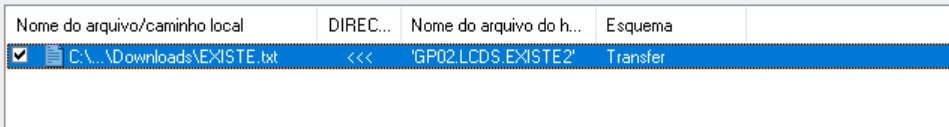
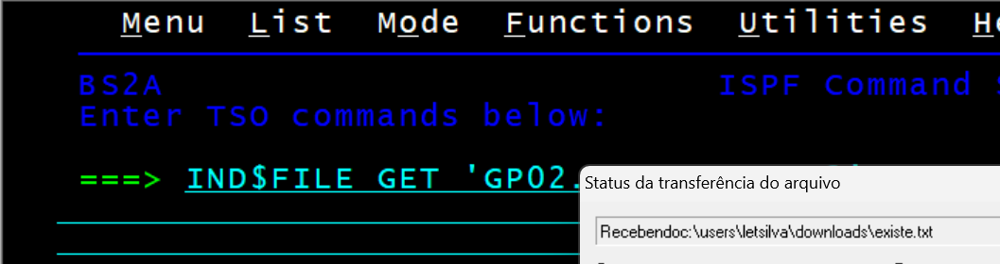

# TRANSFER DE ARQUIVOS MAINFRAME GUI

Programa que faz a automação do teclado e mouse para realizar transferências de arquivos da alta plataforma para a baixa plataforma via ferramenta de transferência do EXTRA! X-treme.

Link para download: https://drive.google.com/drive/folders/1JJA9I8MM_pArR5NphNwJ0W-p2uBHZPy3?usp=sharing

## 🔧 INSTRUÇÕES DE USO

-Deixe apenas um item na lista de transferência.

-Não selecione um diretório de download que tenha acento gráfico.

✅ C:/Users/Usuario1/Downloads

❌ C:/Users/Usuario1/Área de Trabalho

-Ative as opções de conclusão de transferência.

-Siga as instruções e utilize um DSNAME válido para fazer o mapeamento de transferência com sucesso.

-Siga as instruções e utilize um DSNAME que não existe no mainframe para fazer o mapeamento de transferência com erro.

-Caso a janela do mainframe seja redimencionada ou uma mudança seja feita no layout da ferramenta de transferência do EXTRA! X-treme os mapeamentos terão que ser refeitos.

## ❗ERRO COMUM

-Verifique se o comando TSO está sendo escrito com sucesso pela ferramenta de transferência do EXTRA! X-treme. Caso contrário, interrompa a automação, volte para o menu anterior, entre na tela de transferência novamente e reinicie a automação.

